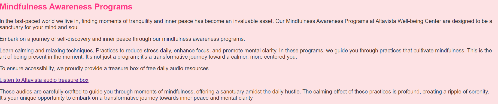

### Altavista Well-being Centre

Altavista Well-being Centre is a holistic health and mindful living place. It is committed to enhancing mental, emotional, and physical well-being. Altavista offers peaceful retreat support groups, inviting individuals to group Pilates classes.

The users are offered free audio samples written on the website to invite to the transformative journey of self-discovery. There is also an option to check the schedule for current classes. If the user subscribes to the email program, he is offered 2 free Pilates classes, which is an advantage for the user. And in such way, the centre can attract new customers. The website is suitable for adult people who are searching for inner peace and care about their well-being.
Link to Live project [Live Project](https://oksana0020.github.io/altavista/)

### Contents

[User stories](#user-stories)  
[Wireframes](#wireframe-design)  
[Design](#design)  
[Features](#features)  
[Technologies used](#technologies-used)  
[Responsiveness](#responsiveness)  
[Testing](#testing)  
[UX](#ux)  
[Deployment](#deployment)  
[Sources](#sources)  
[Credits](#credits)

## User stories

User Stories:

1. As a user, I want to explore various well-being programs offered by Altavista Well-being Center.
2. As a user, I want to be able to navigate easily through the website to find information about Pilates, mindfulness programs, and audio practices.
3. As a user, I want to understand the benefits of participating in Pilates classes at Altavista, including improved physical and mental well-being.
4. As a user, I want to learn about the mindfulness awareness programs available at Altavista, including techniques for reducing stress and enhancing mental clarity.
5. As a user, I want to access free audio resources provided by Altavista to help me practice mindfulness and relaxation techniques.
6. As a user, I want to subscribe to Altavista's email program to receive updates and special offers related to well-being progr
7. As a user, I want to read reviews from other customers to understand their experiences with Altavista's well-being programs.
8. As a user, I want to easily find Altavista's contact information in case I have any questions or concerns.
9. As a user, I want to check schedule of classes available at Altavista center

## Wireframe Design

•	The wireframe viewpoint for the website was from wireframe.cc

## Design

### Color Scheme

•	The background color chosen for the website is #fde2e4, which is a light pinkish tone. This color creates a soft and welcoming atmosphere.
•	The primary accent color used throughout the website is #ff3385, a vibrant pinkish-red shade. This color adds energy and draws attention to important elements.
•	For buttons, the colors #ff3385 and #800080 are used. These colors contrast well with the background color and provide clear visual cues for interactive elements.
•	The review boxes have a background color of #fcbacb, a light peach tone. This color adds warmth and complements the overall color scheme of the website.

### Font

•	The font family chosen for the website is "Arial" as the fallback font and "Noto Sans" as the primary font family. "Noto Sans" is a clean and modern font that enhances readability and visual appeal.
•	The font size is set to 1em for most of the content, providing a comfortable reading experience for users.
•	Headings such as h1 and h2 have unique styles with colors such as #fc46aa and #ff3385, making them stand out and grabbing the user's attention.

### Icons

•	Icons are taken from the Fontawesome Icon library
•	[Fontawesome]( https://fontawesome.com/)

Overall, the color scheme and font choices create a visually appealing and user-friendly experience for visitors to the Altavista Well-being Center website. The combination of soft tones and vibrant accents contributes to a calming yet engaging atmosphere, aligning with the center's focus on promoting health and happiness.

The layout of the website is structured for intuitive navigation, with a clear hierarchy of content facilitated by headings, sections, and navigation links. Elements such as the header, footer, and navigation menu are designed to enhance usability and facilitate seamless interaction. Additionally, the responsive design ensures optimal viewing experiences across various screen sizes and devices.

## FEATURES

Altavista Well-being Center Landing Page Overview: The landing page is creating a positive first impression to the user. The landing page shows that Altavista offers mindfulness programs, Pilates training, and other well-being offerings. Clear and concise text ensures that users can quickly understand the site's scope and relevance. The prominent feature of the landing page is a photograph that serves a dual purpose. Firstly, it visually showcases the essence of Altavista, giving users a glimpse of connection to happy restful life like a flower. Secondly, the image incorporates text overlay, providing the name of the centre.
Landing page image

The navigation of the Alta Vista Well-being Centre website is designed to provide users with easy access to different sections and information.  The "Home" link is the first option in the navigation bar, likely serving as a way to return to the main or introductory section of the website.
Mindfulness Programs section of navigation bar brings the user to the appropriate section of the main page which focuses on Mindfulness Awareness Programs offered in the centre, emphasizing the importance of finding inner peace in today's fast world. Users can join one of programs by email.

There is section on the home page with reviews from existing customers

The Subscribe section bring the user to specific section on index page and encourages users to subscribe to Alta Vista's Free Mindful Awareness Email Program. By subscribing, users can receive two free Pilates lessons in the studio. The subscription form includes fields for the user's first name, last name, email, and phone number which makes the process easy to follow.

Contact us section contains map and current address of the center.

The next page Pilates provides information about Pilates training offered at Altavista. Users can learn about the unique experience provided at the well-being centre and get familiar with current schedule.

The Altavista audio link directs users to a separate page ("audio.html") where they can access free daily audio resources aimed at promoting mindfulness and relaxation. The content includes various audio practices.

### Potential Future features

•	add form to write feedback online

## Technologies Used

Languages

•	HTML
o	Page markup.
•	CSS
o	Styling.
•	Javascript
o	Running function for interactive.
Libraries
•	Fontawesome
o	Used for icons
Platforms
•	Github
•	Codeanywhere

## Responsiveness

•	The website was tested on mobile phone, tablet and desktop screen sizes and no issues were identified.
•	On mobile phone screen sizes menu is changed into toggle placed on the right side, once clicked menu appears in the column after the banner page.
•	On tablets and desktop screen sizes there is regular menu on top of the page before the banner photo.
Responsiveness was also checked with <https://www.responsivedesignchecker.com/>

Mobile device
•	

Tablet
•	

Desktop
•	

### UX

### Site Goals

The site wants to attract users that want to explore mindful programmes and pilates.

## Testing

•	HTML has been validated with W3C HTML5 Validator.
•	CSS has been validated with W3C CSS Validator
•	JavaScript (JSHint)

Lighthouse

I tested the website using Chrome, Firefox and Microsoft Edge.
Form testing
Location	Test	Expected Result	Result
Subscribe form	No first name entered	Error message appears below input box	Passed
Subscribe form	No last name entered	Error message appears below input box	Passed
Subscribe form	No email entered	Error message appears below input box	Passed
Subscribe form	Only letters entered for email without ‘@’	Error message appears below input box indicating that email should contain ‘@’	Passed
Subscribe form	No phone entered	Error message appears below input box	Passed
Subscribe form	All fields entered	Congratulations message with data displayed	Passed

## Bugs

Menu improved for mobile view.
Extra CSS applied to the form.
Links fixed between pages.
Fixing form submission, so submitted details are displayed to the user.

## Unfixed Bugs

•	None all bugs are fixed

## Deployment

The site was deployed to GitHub pages. The steps to deploy are:
•	On GitHub, navigate to your site's repository.
•	Under your repository's name, click "Settings".
•	In the "Code and Automation" section on the left sidebar, click on "Pages".
•	Under "Source" in the "Build and Deployment", select "Deploy from a branch".
•	From the "Source" section drop-down menu, select the Master Branch.
•	Once the Master Branch has been selected, click "Save".
•	Return to your repository and wait a few minutes.
•	Go to the "Deployments" section in the right sidebar.
•	Click on the link to see your deployed repository.

Live link [here](https://oksana0020.github.io/altavista/)

## Credits

•	www.w3schools.com to check CSS and HTML properties

•	www.responsivedesignchecker.com to test the responsiveness of the website.

•	Referring to Love Running project from CodeInstitute as example of developing live website

•	Payne, S. (2023, 04 21). Resolving the Issue of Content Overlapping Footer. Retrieved from Copyprogramming: <https://copyprogramming.com/howto/how-to-fix-a-footer-overlapping-content?utm_content=cmp-true>

•	Google Website Responsiveness Checker extension:
<https://sites.google.com/view/website-responsiveness-checker>

•	All picture, audios are taken from <https://pixabay.com/>

•	All pictures are resized for the Web using Photoshop 2022

•	Map example is taken from Coders Coffeehouse <https://learn.codeinstitute.net/courses/course-v1:CodeInstitute+LRR101+2021_T1/courseware/9645be8635124d76b35692f1f1f6b753/2c4f82a9ef174830aa83ff2cf10f4bc7/?child=first->
